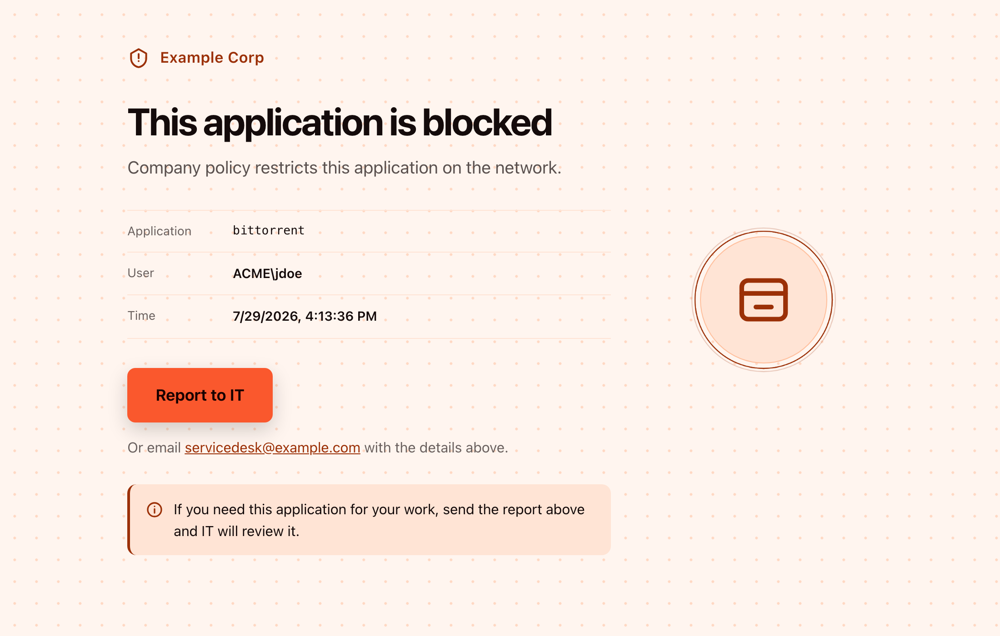

# panos-response-pages

[](https://github.com/kaisero/panos-response-pages/actions/workflows/ci.yml)
[](https://www.python.org)
[](LICENSE)

Modern, responsive response pages for PAN-OS. Generate response pages to delight users while protecting them from threats.

**[Full documentation →](https://kaisero.github.io/panos-response-pages/)**

## Table of Contents

- [Preview](#preview)
- [Features](#features)
- [Quickstart](#quickstart)
- [Development](#development)
- [License](#license)

## Preview

[](https://kaisero.github.io/panos-response-pages/preview/)

Full Preview available via [Github Pages](https://kaisero.github.io/panos-response-pages/preview/) pages.


## Features

Use `panos-response-pages` to generate response pages that

- Provide responsive design for desktop and mobile
- Automatically serve light or dark mode depending on OS settings
- Automatically redirect users to sanctioned apps based on URL category match
- Link to the IT service desk via mail or link
- Support 7 themes across 4 colour palettes

## Quickstart

Install it:

```bash
pip install panos-response-pages
```

Or, with [uv](https://docs.astral.sh/uv/):

```bash
uv tool install panos-response-pages
uvx panos-response-pages build          # or run it without installing
```

Build the pages:

```bash
panos-response-pages build              # every style, into ./out
panos-response-pages themes             # what styles exist
panos-response-pages palettes           # what colour palettes exist
```

`out/deploy/<style>/<palette>/` is what you import into PAN-OS.
`out/preview/index.html` is a clickthrough gallery for review — style, palette,
page, viewport and colour scheme — built with sample data standing in for the
PAN-OS tokens.

Seven styles ship, all supporting both colour schemes. Six wear any of the three
brand palettes: `assist`, `record`, `banner`, `glass`, `beacon`, `mesh`. `nyan`
pins a palette of its own. See [Styles].

### Customise

Copy the shipped shells, palettes, themes and config out, then edit them:

```bash
panos-response-pages init               # into ~/.panos_response_pages, which build finds on its own
```

Put your own settings in `config/<customer>.json`. It is deep-merged over
`config/_defaults.json`, so list only what differs:

```json
{
  "company": "Example Corp",
  "supportUrl": "https://servicedesk.example.com/new-ticket",
  "supportEmail": "",
  "supportLabel": "the Service Desk",
  "redirect": {
    "enabled": true,
    "categories": {
      "online-storage-and-backup": {
        "app": "Company Drive",
        "url": "https://drive.example.com/",
        "seconds": 5,
        "message": "Work files belong on {app}. Taking you there."
      }
    }
  }
}
```

- **`company`** is the wordmark on every page.
- **`supportUrl`** points "Report to IT" at a ticket system instead of a mailbox.
  It must be an absolute `https://` URL — a response page is served *as* the
  blocked site, so a relative path resolves against whatever host refused the
  user. `supportEmail` and `supportUrl` are mutually exclusive: set one and blank
  the other, or the build stops. `supportLabel` names the queue for the places
  that print the contact inline — in email mode those print the address itself,
  so it applies to `supportUrl` mode only.
- **`redirect`** hands a user over to a sanctioned app after a countdown when the
  blocked category has an approved equivalent. It applies to the URL block page
  only. A category needs no entry in `categories` to redirect — that map lists
  only the ones whose tone or wording differs, and anything absent from it is
  calm — but a category listed there as `warn` or `critical` is refused, because
  a user must never be forwarded off a security block. Make sure your security
  policy actually permits the target, or the redirect lands on another block page.

Then build against it:

```bash
panos-response-pages build --customer <name>
```

## Development

```bash
uv sync --all-groups
uv run pre-commit install
uv run nox                            # lint, type-check, tests, docs
```

`nox -s tests` runs the suite with coverage; the gate is 93%. Commit `uv.lock`.

## License

MIT. See [LICENSE](LICENSE).
